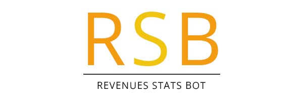
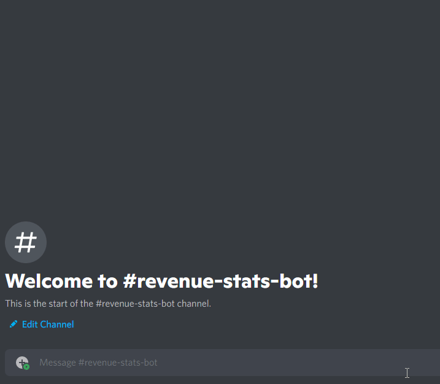
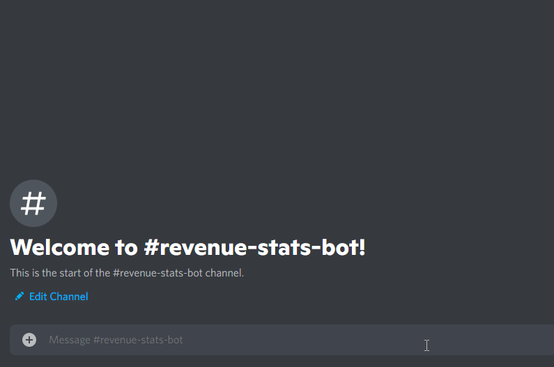
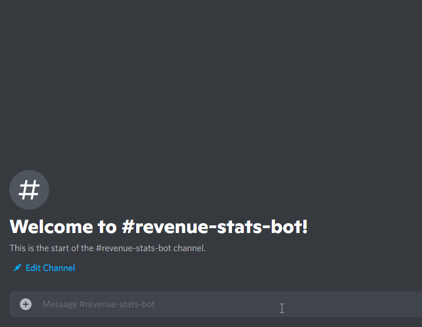

<h1 align="center">
    <br>
    
    <br>
</h1>

<h4 align="center">A revenue manager bot built on top of <a href="https://nodejs.org/en/" target="_blank">Node.js</a>.
</br>
</br>
<a href="https://www.npmjs.com/package/discord.js"></a>
<a href="https://www.npmjs.com/package/discord.js"></a>
<a href="https://www.npmjs.com/package/discord.js"></a>
<a href="https://www.npmjs.com/package/discord.js"></a>
</h4>


## Features
- Data saved in a **MySql** database
- **Chart visualisation** of monthly earning
- Easy to **add** and **remove** a revenue
- Simple **setup** and **hosting**
- **Slash command** bot

## Commands
- /revenue-add Amount Currency Platform Customer Project
> /revenue-add 150 $ fiverr Florian Discordbot
- /revenue-list Month Year
> /revenue-list 04 2022
- /revenue-remove Id 
> /revenue-remove 5 (found in list command on footer)

## Display & Design
```js
/revenu-list
``` 
 

```js
/revenu-add
``` 
 
```js
/revenu-remove
``` 
 


